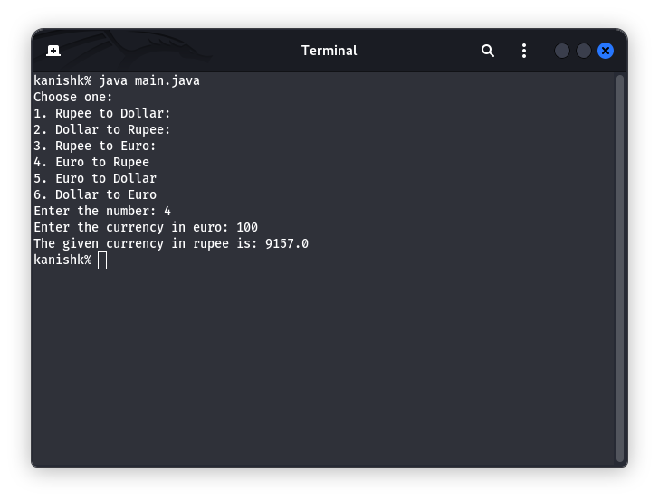

<h1 align="center"><b>Currency Converter</b></h1>

### Features

- Beginners friendly
- Convert currancy into rupee to dollar.
- Convert currancy into dollar to rupee.
- Convert currancy into rupee to euro.
- Convert currancy into dollar to euro.
- Convert currancy into euro to rupee.
- Convert currancy into euro to dollar.

##

### Installation and Use

- First open the terminal or command prompt
- Just, Clone this repository -

  ```
  $ git clone https://github.com/Kanishk-Chaudhary/Currency-Converter
  ```

- Now go to cloned directory and run `main.java` -

  ```
  $ cd Currency-Converter
  $ java main.java
  ```

- On first launch, It'll install the dependencies and that's it. **_Currency Converter_** is installed.

##

<details>
  <summary><h3>Dependencies</h3></summary>

<b>Currency Converter</b> requires following programs to run properly -

- `git`
- `java`

</details>

<details>
  <summary><h3>Tested on</h3></summary>

- **Ubuntu**
- **Kali**
- **Windows**
</details>

##

<h3 align="center"><i>:: Workflow ::</i></h3>
<p align="center">

</p>
